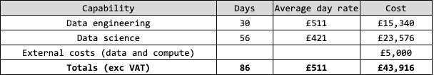

# Context

The Ada Lovelace Institute and the Nuffield Council for Bioethics are currently working on a project to map potential futures for the application of Artificial Intelligence (AI) in genomics and explore their societal and policy implications. Nesta will be contributing to the project through a scientometric analysis of key features of AI genomics Research and Development (R&D).[^1]

[^1]: R&D encompasses activities to produce and apply new knowledge ranging from basic research to technology development and the launch of new products, services and tools.

Some areas of interest include:

1. What are the levels of R&D activity in the intersection of AI and genomics? How have they evolved over time?
2. What is the topical composition of the field? What are "emergent topics" in AI and genomics?
3. What institutions are participating in AI genomics R&D? What is their geography? What is their character (e.g. public, private)?
4. What are the key differences between AI applications to genomics and the wider field of genomics in terms of application areas, participants and stakeholders, influence and impact etc.?

Our analysis will result in a report addressing questions such as those above to provide an empirical context for the AI Genomics Futures project and inform subsequent activities such as an horizon-scanning exercise and stakeholder engagement activities.

## About this note

Section 2 describes the methodology for the project including data sources that we propose to use, how we will process them, enrich them and analyse them, and the research questions that these questions will help us address.

Section 3 sets out how we propose to deliver the project including its outputs, approach to project management, timelines and budget.

# Methodology

## High level methodological narrative

We distinguish between core project activities and stretch goals.

At its core, the project will create a novel dataset about AI and genomics R&D that we will analyse in order to map its landscape. In order to do this, we will collect, enrich and analyse data about research, technology development and business activities and enrich it with information about the geography and character of actors (e.g. researchers, inventors, entrepreneurs) participating in AI genomics R&D and the purpose and influence (e.g. citations, social media reach) of their R&D activities. 

We will analyse these data with Natural Language Processing (NLP) and machine learning methods. This will help us tag projects / patents / companies with categories of interest such as the disease areas they target, measure the composition of AI genomics R&D (e.g. key research themes and technological trajectories) and identify emerging trends that might be of particular interest to the project. This will also help us create and compare the specialisation profiles of different countries / actors / types of actors (e.g. private sector vs academic researchers). Where possible we will benchmark the situation in AI genomics R&D vs. the wider field of genomics.

As stretch goals, we will explore:

- How to integrate all the datasets we are collecting in a consistent taxonomy that makes it possible to unify their analysis,
- Additional data sources,
- Experimental indicators capturing novelty, diversity and interdisciplinarity in AI genomics R&D and,
- Models to explain and predict outcomes of interest.

In terms of temporal coverage, we will focus our analysis on the last decade, noting that the deep learning techniques underpinning modern AI systems only started being widely adopted since ca. 2012. Having said this, all the datasets we are using go further back, enabling longer-term analyses of R&D trends if those are perceived to be relevant for the project.

In the next subsection we highlight key data streams for the project: the data we plan to collect, how we will identify AI and genomics R&D in it and how we will enrich it.

Having done this we outline potential methods to analyse these data.

## Data streams

### Research data

We include open research activities in this project for three reasons:

1. Research (in particular preprints) is likely to provide a timelier indicator of current and emerging trends in AI genomics than laggy patent and business activity data.
2. Earlier-stage, emerging trends that might be relevant in the future are more likely to be present in research data than other sources that tell us about the techniques that are being applied today.
3. There are strong traditions of open publishing in genomics and AI research

We recognise that publication data would, on its own, provide a skewed view of the situation and evolution of AI genomics R&D (e.g. not helping to distinguish between theoretical and applied activities, and missing R&D activities that businesses choose not to publish for commercial reasons). We will address these gaps by incorporating patent and business data into the project.

#### Collection

We will use [OpenAlex](https://www.openalex.org) as our core research data source. OpenAlex is an open scientometric database developed to replace Microsoft Academic Graph, a database of academic publications that was recently discontinued. OpenAlex includes information about:

- Works (papers, books, datasets etc., [example](https://api.openalex.org/works/W2741809807))
- Authors (who create works, [example](https://api.openalex.org/authors/A2208157607))
- Venues (journals/repos that contains works, [example](https://api.openalex.org/venues/V1983995261))
- Institutions (organisations/institutions affiliated with a work, [example](https://openalex.org/I114027177))
- Concepts (tags works with topics [example](https://openalex.org/C2778407487))

OpenAlex is a new database but current discussions suggest that it is the best open dataset available, and that _it's coverage and accuracy_ is already comparable to established players such as Scopus or Dimensions.

The main ways of interacting with the dataset are via the API, or through database snapshots. We currently envisage downloading the most recent snapshot (200GB) and storing it as a collection of tables for analysis.

We will identify papers related to AI and genomics through their `concepts`, which are keywords assigned to the data based on a text analysis of their abstract. A preliminary exploration of the data has revealed around 400,000 papers with the `Genome` concept and `37,000` papers with the `Genome` and `Computer Science` concepts. One important task at the beginning of the project will be to generate a list of concepts that capture the field of AI & Genomics.

#### Processing

Having collected the OpenAlex dataset, we will enrich it in the following days:

- Add institutional metadata: The institutional affiliations to OpenAlex paper include a `GRID` identifier which make it possible to enrich those institutions with metadata from [GRID](https://www.grid.ac/) (Global Research Identifier Database), such as an institution's location at various levels of geographical resolution and its character (whether it is an educational institution, a private sector organisation, a hospital, a government agency, etc.)
- Add citation data: We will collect information about the citations in a paper and the citations that it has received using [Semantic Scholar](https://www.semanticscholar.org/), a platform that uses AI to advance scientific discovery. Semantic Scholar data can be accessed by querying its API with a document identifier (which we will obtain from OpenAlex). Citation data will help us proxy a paper's influence in the academic community, and to measure the bodies of knowledge that a paper builds on (e.g. does the paper mostly cite AI research, or research from the biological sciences, does it cite particular databases, does it cite papers from the Humanities suggesting that it takes into account ethical issues?).
- Add social influence engagement information (stretch goal): We could use [Crossref Event](https://www.crossref.org/services/event-data/) to measure level of public engagement with research publications in a variety of venues such as Twitter, Wikipedia, Reddit or WordPress. Crossref offers an [open API](https://www.eventdata.crossref.org/guide/) that can be queried with a paper's DOI (Digital Object Identifier) in order to obtain links to its social media engagements. We note that the actual content of an article's social engagements require additional data collection from its primary sources (e.g. querying the Twitter API), which we see as out of scope for this project. Here, we would simply generate an indicator with the number of social media engagements that an article has received, a proxy of public interest in it.

### Patent data

Patents can help us measure how particular AI genomics methods are being transformed into practical applications / technologies.

#### Collection

Having scoped a range of data sources (see [online annex](https://github.com/nestauk/ai_genomics/blob/22_spec/docs/tech_spec.md)), we currently believe that the current pipeline for patent data collection and enrichment is particularly promising:

1. Use the USPTO (US Patent and Trademark Office ) [Artificial Intelligence Patent Dataset](https://www.uspto.gov/ip-policy/economic-research/research-datasets/artificial-intelligence-patent-dataset), a database of AI patents filed with the USPTO, to identify AI patents.
2. Query the USPTO API to collect additional information about those patents and label as "genomics" those with IPC (International Patent Classification) codes related to genomics or research in the biological sciences.
3. Optionally: Collect additional information about those patents from [Lens](https://www.lens.org/), a public resource about global patents and research knowledge which includes information about the institutions related to a patent. We could fuzzy-match these institutions with GRID in order to obtain their location and type of institution.

One limitation of this approach is that it will only provide us with information about AI genomics patents filed in the USA. We expect most economically significant / frontier technology development - activities which are of particular interest to the project - to be captured in the data.

### Business data

We are also interested in measuring business and investment activity around AI and genomics.

#### Data collection

We will use [CrunchBase](https://www.crunchbase.com/), a database with information about technology companies and startups and their investments that we have already licensed and analysed in other projects. More specifically:

1. We will identify AI genomics companies by analysing the keywords that they are labelled with and the text in their descriptions.
2. We will extract all relevant information about those companies including their description, location, year of incorporation and number of employees
3. We will identify "investment events" (e.g. seed funding, various venture capital investment rounds, research rounds etc.) for those companies and their evolution, and the investors who were involved in those events.

### Other sources

We have also considered / have access to other data sources which might be relevant for the project but that we perceive, at this point, as "stretch goals" rather than core priorities. They include:

- Public funding data: We have relatively easy access to public funding data from the UK ([Gateway to Research](https://gtr.ukri.org/), EU ([CORDIS](https://cordis.europa.eu/)) and the US ([NIH Reporter](https://reporter.nih.gov/)). It would be possible to analyse these data to measure levels of public support for AI genomics research and its topical focus but there are some fixed costs in ingesting and harmonising them and implementing robust definitions of AI and Genomics through a bottom-up analysis of grant descriptions / abstracts. One option would be to carry out a quantitative case study of the evolution and composition of public funding for AI genomics in the UK using the GtR data as we are particularly familiar with this source and it could be specially relevant for the project.
- AI software and datasets: [Papers With Code](https://paperswithcode.com/) is a crowd / machine sourced platform that links AI papers to the GitHub repositories where they store their software code, and to the datasets that we used. In principle, we could use it to measure the availability of software to implement AI genomics methods, another proxy for their "technological readiness". A preliminary analysis of this data source revealed few papers / datasets of interest to the project (~100 papers, 30 datasets mentioning genomics in their description).
- Open source software: There are ca. [1700 GitHub code repositories](https://github.com/topics/genomics) tagged with the `genomics` label, and [79,800 machine lerning repositories](https://github.com/topics/genomics). We could use the GitHub API to extract data about these repositories and analyse their content. Restrictions in the GitHub API rates mean that this would be a time-intensive task.
- [DrugBank](https://go.drugbank.com/) is a database with detailed information about drugs, their mechanisms, their interactions, and their protein targets. In principle we could analyse it in order to identify drugs / projects / analyses e.g. of pharmacogenomics (interactions between a drug and genome) that use machine learning methods but this would only capture one dimension of AI genomics and would require a significant investment in collecting, exploring and understanding the data.
- [Scite.ai](https://scite.ai/) is a tool that offers in-depth analysis of the citations received by a research article, including whether they are "supportive" or "contrasting". Although this dataset could help us to understand in more detail the network structure of AI genomics and the degree of consensus or disagreement between its constituent communities, we would need to licence the data and potentially spend a significant amount of time becoming familiar with it. In the first part of the project we will explore options to access the data.

## Analysis

Here we outline various strategies to analyse the data in order to address key questions for the project.

### Entity extraction

We would like to measure the purpose / goal of AI and genomics R&D activities using a standardised set of terms. This would for example help us identify the disease areas that researchers focus on and the disease areas that they (perhaps) neglect as well as how this focus has evolved over time, and differences between countries, organisation types etc.

In order to do this, we will leverage a data pipeline being developed at Nesta which annotates text documents (e.g. abstracts) with their [DBPedia entities](https://www.dbpedia.org/resources/ontology/). Some of these entities are linked to Medical Subject Heading ([MeSH](https://www.nlm.nih.gov/mesh/meshhome.html)), an ontology developed by the US National Institute of Health to label biomedical research which we could leverage for subsequent analysis. Here are some examples of DBPedia entities of relevance to the project:

- [GigaDB](https://dbpedia.org/page/GigaDB), a _"disciplinary repository launched in 2011 with the aim of ensuring long-term access to massive multidimensional datasets from life science and biomedical science studies."_
- [Alzheimer's Disease](https://dbpedia.org/page/Alzheimer's_disease), _"a neurodegenerative disease that usually starts slowly and progressively worsens. It is the cause of 60–70% of cases of dementia."_
- [Pharmacogenomics](https://dbpedia.org/page/Pharmacogenomics), a subdiscipline that _" analyzes how the genetic makeup of an individual affects their response to drugs."_

### Thematic analysis

In addition to extracting named entities from abstracts, we will use other data-driven methods to characterise the composition of AI genomics sub-corpora and identify emerging themes within them. Some potential strategies for this include:

- Topic modelling of article / patent abstracts and company descriptions. This method yields the themes in a corpus (collections of terms that tend to appear in the same documents) and estimates the relative importance (weight) of different topics in each document. We can use this to classify projects into their most important topics (and study the evolution of different topics over time), measure overlap between topics and calculate sophisticated indicators of research interdisciplinarity, diversity and novelty (see below for additional details).
- Analysis of emergence: In the [Innovation Sweetspots project](https://www.nesta.org.uk/data-visualisation-and-interactive/innovation-sweet-spots/?gclid=CjwKCAjwve2TBhByEiwAaktM1J4_ttJAYyygmlXbtKFlnMF_b5AmUiCRoV_RQ6HWCHIODdMKR4BL5xoCNecQAvD_BwE), Nesta researchers have developed methods to identify "emerging topics" around low-carbon heating technologies. Their approach combines measures of volume of activity and measures of acceleration (increasing rates of growth) in a topic to classify it in a set of categories (hot, emerging, dormant, stabilising) (See figure below). We will apply this measurement framework to the analysis of trends in AI in genomics R&D.
- Document clustering (stretch goal): [Semantic Scholar](https://www.semanticscholar.org/) and [Google Patent Dataset](https://console.cloud.google.com/marketplace/product/google_patents_public_datasets/google-patents-public-data?project=hp-data-dumps) have created vector representations of research paper abstracts and patents. These vector representations capture the "meaning" of those documents in a multidimensional space. We could use them to cluster those documents into semantically similar groups capturing specific research themes / application areas / techniques.

### Additional analyses

Other analyses that we could undertake depending on time, resources and interest include:

- Influence analysis: In addition to using forward citations (citations received by a paper) to proxy its influence and impact, we could also analyse its backward citations (citations that it makes to other papers) to capture the bodies of knowledge it builds on e.g. its reliance on knwoledge from computer science versus biological sciences or even other disciplines. This could help us build measures of disciplinary influence and interdisciplinary crossover in genomics research.
- Advanced indicators: We could build advanced indicators such as:
  - A paper's interdisciplinarity based on the distribution of its thematic composition or influences (more concentrated thematic distributions will tend to be less interdisciplinarity)
  - Measures of novelty based on the rarity of the topics or subjects that the paper brings together, or their semantic distance to existing corpora (clusters) of research.
  - Measures of thematic diversity in the research ideas that are explored by different research communities / countries or even the AI and genomics community writ large.
- Integrated thematic analysis: We could explore options to classify all documents (including e.g. articles, patents, companies, research grants) into a unified set of categories / topics. A naive approach to do this would be to combine all our documents into a single corpus and train a topic model or clustering algorithm on it. This approach might be skewed by differences in language across data sources (e.g. language used in academic articles vs. patents) so we might have to explore alternatives such as tagging documents with DBPedia entities (as discussed above) and clustering them on their frequencies, or performing clustering on one of our corpora (e.g. research articles) and then assigning documents from other corpora to their closest clusters in semantic space.

# Project delivery

## Outputs

The project outputs are:

1. A report describing our definitions, methodology and findings
2. A [GitHub repository](https://github.com/nestauk/ai_genomics) with all the (Python) code that we have developed in the project enabling review, improvement and future updates.
3. Where possible (e.g. where we are using open datasets such as OpenAlex), open datasets to enable follow-on replications and new analysis published in a platform to be agreed (e.g. Zenodo).

## Approach to project management

We propose to organise the project using an agile approach with the following features:

- We will create a product backlog with use cases ranked by priority. The use cases will capture research questions we want to address / analytical outputs we want to generate. Use cases are decomposed into tasks (e.g. collecting specific datasets, enriching them, performing exploratory analyses and modelling, addressing research questions, carrying out robustness tests, writing up results etc.) which we log as issues in the project GitHub repository.
- Prioritisation between use cases / tasks / issues is a joint effort between key project stakeholders (Ada Lovelace Institute, Nuffield Council for Bioethics, AI Genomics Futures advisory board) and the Nesta Development team. Juan Mateos-Garcia will be the main liaison between both groups, acting as "product manager".
- The basic unit of activity in the project is a two-week sprint, where the team selects and pursues top use cases from the product backlog agreed with key stakeholders. The sprint includes regular internal meetings to assess progress and an end-of-sprint review meeting with potential participation from key project stakeholders (although it might be more practical to involve stakeholders at the end of each project epic, see below for additional information).

## Timelines

We propose to group the sprints into three "epics" generating subsequently more polished and detailed versions of the final product (report). The tables below summarise the content of each epic and provide a gantt chart for the project:

| Epic                                           | Content                                                                                                                                                                                                                                                                                                                             | Sprint (n) |
| -------------------------------------------------------------------------------------------- | ------------------------------------------------------------------------------------------------------------------------------------------------------------------------------------------------------------------------------------------------------------------------------------------------------------ | :--------------------------------: |
| 1. Data collection, processing and exploration | In this epic, we create the core datasets for the project and start their exploratory analysis. The working product at the end of the epic is the data sources section of the report and the results of exploratory analyses that help us assess data quality, identify key trends and identify opportunities to follow-on analysis |     4      |
| 2. Analysis and modelling                      | In this epic, we analyse the core datasets for the project. The working product at the end of the epic is the methodology and findings section of the report addressing core questions for the project                                                                                                                              |     3      |
| 3. Stretch goals and contingency sprint        | In this epic, we polish existing analyses and pursue stretch goals. It also provides some contingency time. The working product at the end of the epic is the final project report.                                                                                                                                                 |     2      |

Assuming that the project starts on the 6/6/2022, this would mean that...

- Description of data sources and descriptive analysis are available on w/c 25/7/2022.
- Methodology and core findings are available on w/c 5/9/2022
- Final report, data and code are available on w/c 3/10/2022.

## Budget

The table below presents the budget for the project. The project team will include:

- Data engineers: Jack Vines (Senior Engineering Lead) and Samuel Doogan (Full-stack developer)
- Data scientists: Juan Mateos-Garcia (Director), George Richardson (Head of Data Science), India Kerle (Junior Data Scientist)

