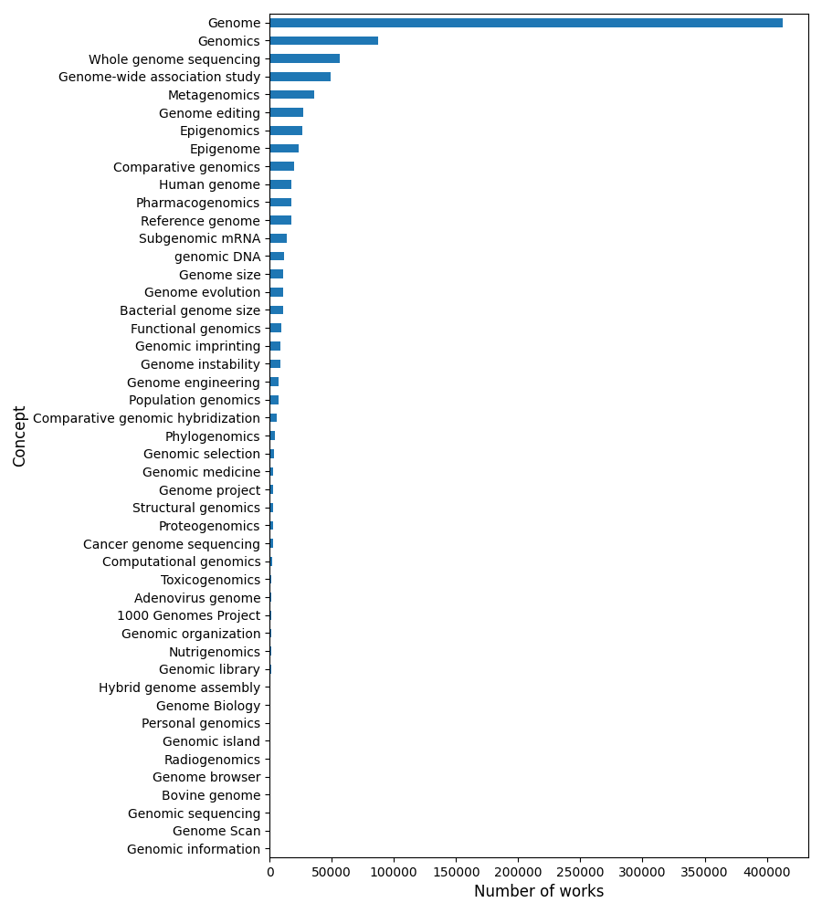

# Data sources {#sec:data}

This section describes the data sources we are using in the project and how we have collected and processed them. We also discuss strategies to operationalise the definition of AI and genomics in each of these data sources.

## Research data: OpenAlex

### Motivation

We include open research activities in our analysis of AI in genomics for three reasons:

1. Research (in particular preprints) is likely to provide a timelier indicator of current and emerging trends in AI genomics than laggy patent and business activity data.
2. Earlier-stage, emerging trends that might be relevant in the future are more likely to be present in research data than other sources that tell us about the techniques that are being applied today.
3. There are strong traditions of open publishing in genomics and AI research

We recognise that publication data would, on its own, provide a skewed view of the situation and evolution of AI genomics R&D (e.g. not helping to distinguish between theoretical and applied activities, and missing R&D activities that businesses choose not to publish for commercial reasons). We will address these gaps by incorporating patent and business data into the project, and through an analysis of the content of research data.

### Collection

We use [OpenAlex](https://www.openalex.org) as our core research data source. OpenAlex is an open scientometric database developed to replace Microsoft Academic Graph, a database of academic publications that was recently discontinued. OpenAlex includes information about:

- Works (papers, books, datasets etc., [example](https://api.openalex.org/works/W2741809807))
- Authors (who create works, [example](https://api.openalex.org/authors/A2208157607))
- Venues (journals/repos that contains works, [example](https://api.openalex.org/venues/V1983995261))
- Institutions (organisations/institutions affiliated with a work, [example](https://openalex.org/I114027177))
- Concepts (tags works with topics based on a machine learning analysis of the MAG corpus [example](https://openalex.org/C2778407487))[^2])

[^2]: See [here](https://docs.google.com/document/d/1OgXSLriHO3Ekz0OYoaoP_h0sPcuvV4EqX7VgLLblKe4/edit) for additional information about OpenAlex' concept-tagging methodology.

OpenAlex is a new database but current discussions suggest that it is the best open dataset available. Its coverage and accuracy is already comparable to established players such as Scopus or Dimensions, and it may [surpass MAG](https://arxiv.org/abs/2206.14168) in some aspects.

OpenAlex provides an [open and accessible API](https://docs.openalex.org/api) for querying and collecting data from its corpus. Our approach has been to use broad, high-level concepts related to our areas of interest, and query the corpus of works for each of the last 15 years that have been tagged with those concepts, to build a collection of works that covers all potentially relevant papers. Through a combination of batch processing these queries in parallel, and the high level of efficiency and stability of OpenAlex's API, this collection can be done in under a day.

We have collected all the OpenAlex `works` (papers) tagged with the concepts "Artificial intelligence" (around 2 million documents) and "Genetics" (453K documents) and filtered them further through the steps that we describe below:

### Generic processing

We have removed from our corpora all works missing an abstract and applied the [FastText language classifier](https://fasttext.cc/docs/en/language-identification.html) to titles in order to identify those in English, and remove the rest.[^3]

[^3]:
    Concept tagging in non-English articles might be less reliable, and they are not suitable for downstream analysis using Natural Language Processing. We could include in specific parts of the analysis if useful. ]
    This leaves us with 1.33 million AI articles and 315K Genetics articles.

### Artificial intelligence corpus processing

A visual inspection of a subset of the AI corpus suggests that there is a non-trivial number of false positives in the data. In particular, we have noticed a number of systematic misclassifications of papers in the following topics:

- Education: This includes papers about learning and learners, which get confused with machine learning.
- Neuroscience: This includes papers about biological neural networks, which get confused with artificial neural networks used in AI research.
- ICT: This includes papers about telecommunications, ICT networks and cybersecurity that get confused with artificial neural networks and deep networks used in AI research.
- Linguistics: This includes papers about language, translation etc., which get confused with computational linguistics and natural language papers.

We have adopted two strategies to remove false positives from the corpus: First, we have implemented a heuristic filter that removes from the corpus any papers that include terms related to the categories above such as "learning", "neural network" or "language" but no terms related to machine learning and artificial intelligence (see @tbl:terms).

| Terms                                                                                                                                                                                                                                                                                                                                                                                |
| ------------------------------------------------------------------------------------------------------------------------------------------------------------------------------------------------------------------------------------------------------------------------------------------------------------------------------------------------------------------------------------ |
| accuracy, ai, ann, artificial, artificial intelligence, bayes, classifier, clustering, convolution, deep, dnn, encoder, federat, gan, generative, gnn, machine, machine learning, natural language processing, nlp, pattern recognition, predict, rbf, reinforcement, representation, rnn, state of the art, state-of-the-art, statistical, supervis, train, transformer, unsupervis |

: Terms related to AI and machine learning in our heuristic filter {#tbl:terms}

Second, we have excluded articles with concept scores below a threshold value for key concepts. More specifically, we have only retained articles which have either a score above 0.4 in "Artificial intelligence" and/or a score above 0.3 in "Machine learning" and/or a score above 0.6 in "Deep learning".[^4]

[^4]: We note that the resulting corpus will include AI and machine learning papers that use statistical machine learning techniques such as random forests, support vector machines and gradient boosting which the literature suggests have played an important role in the biological sciences and genomics.

We have selected these thresholds after evaluating the impact of various combinations of values on a subset of the data (comprising the years 2012, 2017 and 2021) which we have labelled with information about 1,702 preprints submitted to top AI conferences (including NEURIPS, ICML, CVF, ECCV, AAAI, PMLR, SIGKKD and IJCAI) identified in the [Papers with Code](https://paperswithcode.com/) corpus and 2,256 preprints from the arXiv that are not labelled with AI related categories (cs.AI, cs.CL, cs.CV, cs.IR, cs.LG, cs.NE, cs.SO, math.ST, q-bio.QM, stat.ML), and which we assume are not-related to AI or Machine Learning.

The aforementioned combination performs best in terms of the F1-Score (which combines precision and recall i.e. the ability of the definition to generate accurate positive predictions while reducing the numer of erroneous negative predictions), with a score of 0.64.[^5] This is underpinned by 55% predictive accuracy and 78% recall.

We could easily increase the predictive accuracy of the model at the expense of lower recall. For example, our top parameter combination retains 329,764 articles in the subset of our AI corpus. We could alternatively opt for a a set of thresholds of 0.6, 0.5 and 0.3 in order to increase predictive accuracy to 70% but this would bring down recall to 30% and the size of the corpus to 121,877 articles.

@tbl:examples presents some examples of papers which are correctly / incorrectly classified with our current definition. The "word soup" paper has been misclassified because the OpenAlex system assigned it "Speech recognition" and "Natural Language Processing" tags. In the false negative case of the reinforcement learning paper, we notice that the AI score is below our threshold but (unsurprisingly) the reinforcement score is very high (0.7) suggesting potential avenues to improve our classification by including higher-granularity concepts into our selection procedure.

| Status         | Title                                                                                    |
| -------------- | ---------------------------------------------------------------------------------------- |
| True positive  | A Survey on Language Modeling using Neural Networks                                      |
| False positive | Transcribing handwritten text images with a word soup game                               |
| True negative  | Pedagogical models of concordance use: correlations between concordance user preferences |
| False negative | Dimension-Free Rates for Natural Policy Gradient in Multi-Agent Reinforcement Learning.  |

: Examples of papers in different categories {#tbl:examples}

[^5]: More formally, precision is defined as the percentage of entities which are predicted to be in a class (in our case AI papers) that are in fact in that class; recall is defined as the percentage of instances that are in a class that are predicted in that class.

When we apply all our filters to the data, including the heuristic filters and the concept-based filters, this results in a corpus with 837K observations. Although this is a substantial decrease from the initial 1.9m corpus, it is still likely to overestimate the number of AI papers for reasons noted above. However, given our interest in AI research in the intersection with biological sciences and genomics, we believe that it is at this point desirable to adopt an inclusive definition of AI to avoid losing potentially relevant research activities.

We note that the current definition is provisional and subject to further improvement and refinement. Some options to do this include:

- Further processing downstream when we start analysing the AI genomic corpus
- Using lower-level concepts in the OpenAlex taxonomy
- Using alternative strategies such as topic modelling or keyword search of abstracts instead of relying on OpenAlex concepts

We can also assess the robustness of our findings to adopting more / less strict definitions of AI research.

### Genomics corpus processing

OpenAlex papers obtained from the [PubMed](https://pubmed.ncbi.nlm.nih.gov/) library of biomedical research include their [MeSH](https://www.nlm.nih.gov/mesh/meshhome.html) (Medical Subject Headings) category as well as their OpenAlex concepts. This gives us two parallel avenues to operationalise the genomics definition with different pros and cons: MeSh tags are assigned by human experts and are therefore more likely to be reliable than OpenAlex concepts based on a predictive model. Their downside is that they are not available for all papers. We explore their issues below:

#### OpenAlex concepts

We have extracted all OpenAlex concepts that mention the term "genom". This yields the list portrayed in @fig:concepts.

{#fig:concepts}

Having done this, we have selected all papers in our genetics corpus with at least one genomics concept, which leaves us with 112,271 papers. An initial exploration of the data suggests a lower level of noise / false positives than was the case with the Artificial Intelligence corpus. Unfortunately, it seems that our challenge with the genomics corpus is the opposite than we faced there, which is low recall: many articles in genomics related concepts that we might have expected to find nested within the higher level genetics category that we have already collected are not present there. As an example, when we query our final AI corpus for papers with genomics-related concepts, we find 2,900 papers that are not present in the genetics corpus. This is not necessarily an issue insofar AI genomics papers are nested within AI and our genetics corpus provides a sufficiently large benchmark for comparative analysis.

#### MeSH terms

38% of the papers in the genetics corpus include MeSH terms. We have identified all MeSH headings in that corpus that include the term "genom", which yields 40 terms that are included in 47K papers in the corpus (see @tbl:mesh).

| MeSH                                                                                                                                                                                                                                                                                                                                                                                                                                                                                                                                                                                                                                                                                                                                                                                                                              |
| --------------------------------------------------------------------------------------------------------------------------------------------------------------------------------------------------------------------------------------------------------------------------------------------------------------------------------------------------------------------------------------------------------------------------------------------------------------------------------------------------------------------------------------------------------------------------------------------------------------------------------------------------------------------------------------------------------------------------------------------------------------------------------------------------------------------------------- |
| Achaete-Scute Complex Genome Region, Comparative Genomic Hybridization, Epigenome, Epigenomics, Genome, Genome Components, Genome Size, Genome-Wide Association Study, Genome_Archaeal, Genome_Bacterial, Genome_Chloroplast, Genome_Fungal, Genome_Helminth, Genome_Human, Genome_Insect, Genome_Microbial, Genome_Mitochondrial, Genome_Plant, Genome_Plastid, Genome_Protozoan, Genome_Viral, Genomic Imprinting, Genomic Instability, Genomic Islands, Genomic Library, Genomic Medicine, Genomic Structural Variation, Genomics, Human Genome Project, Metagenome, Metagenomics, National Human Genome Research Institute (U.S.), Nutrigenomics, Pharmacogenomic Testing, Pharmacogenomic Variants, Proteogenomics, Segmental Duplications_Genomic, Viral Genome Packaging, Whole Genome Sequencing, t-Complex Genome Region |

: Genomics related MeSH terms in our the genetics OpenAlex corpus {#tbl:mesh_genom}

We find that 70% of the papers with MeSH genomics-related terms also have OpenAlex genomic-related concept. In total, we find 126,894 papers in our data with a MeSH or OpenAlex genomics-related terms/concepts (and 1,760 in the AI corpus).

#### Crude text search

We have also performed a crude search of the term "genom" within the abstracts in our provisional AI corpus. This reveals 4,437 papers, which is a substantially higher number than the aforementioned 1,760 and suggests gaps in coverage of genomics research when using expert-driven (MeSH) and predictive taxonomies.

One option going forward would be to combine MeSh labels, OpenAlex concepts and texts from abstracts in order to delineate AI genomics applications. This might also be necessary to remove from the analysis areas of genomics research that are less relevant for this project, such as for example research on animal or plant genomics.

#### Combined results

In total, we find 5,017 papers in the intersection of AI and genomics based on our definition of AI and the inclusive definition of genomics taking into account OpenAlex concepts, MeSH terms and abstract search.

This number is not massively out of line with the results of a search for relevant combination of terms such as PubMed but seems to substantially underestimate the number of relevant articles in BiorXiv (excluding articles from 2022).

| Search engine | Terms searched                    | Number of results |
| ------------- | --------------------------------- | ----------------- |
| PubMed        | artificial intelligence, genomics | 1,605             |
| PubMed        | machine learning, genomics        | 941               |
| PubMed        | deep learning, genomics           | 237               |
| PubMed        | svm, genomics                     | 125               |
| BioRxiv       | artificial intelligence, genomics | 2,138             |
| BioRxiv       | artificial intelligence, genomics | 9,833             |
| BioRxiv       | deep learning, genomics           | 8,625             |

: Number of papers returned through queries in relevant online portals {tbl:web_benchmark}

We have identified two explanations for this issue. First, the results returned by BioRxiv's search engine are not always correct (even at the highest levels of relevance), which means that the numbers in {tbl:web_benchmark} are likely to be an overestimate. Second, some machine learning and AI papers in the genetics corpus have not been tagged as such or are tagged at a level of resolution below that of our initial search (i.e. papers with the "Artificial Intelligence" concept).

When we implement a crude search for AI related terms in the abstracts of papers in the genetics corpus we find 4,266 papers. When we combine these with the AI and genomics papers, this yields a grand total of 9,248 AI and genomics papers, susbtantially helping to close the gap with the biorXiv corpus. We provisionally take this as our corpus for analysis. @tbl_ai_genom_oa_examples below presents 10 randomly drawn examples.

| title                                                                                                                                              | abstract (truncated)                                                                                                                                                                                                                                                                                                                                                                                                                                                                                                                                                                                                                                                                                                                  |
| :------------------------------------------------------------------------------------------------------------------------------------------------- | :------------------------------------------------------------------------------------------------------------------------------------------------------------------------------------------------------------------------------------------------------------------------------------------------------------------------------------------------------------------------------------------------------------------------------------------------------------------------------------------------------------------------------------------------------------------------------------------------------------------------------------------------------------------------------------------------------------------------------------ |
| Gene Extraction Based on Sparse Singular Value Decomposition                                                                                       | In this paper, we develop a new feature extraction method based on sparse singular value decomposition (SSVD). We apply SSVD algorithm to select the characteristic genes from Colorectal Cancer (CRC) genomic dataset, and then the differentially expressed genes obtained are evaluated by the tools based on Gene Ontology. As a gene extraction method, SSVD is also compared with some existing feature extraction methods such as independent component analysis (ICA), the p-norm robust feature extraction (PREE) and sparse principal component analysis (SPCA). The experimental results show that SSVD method outperforms the existing algorithms...                                                                      |
| High performance computing for large-scale genomic prediction                                                                                      | In the past decades genetics was studied intensively leading to the knowledge that DNA is the molecule behind genetic inheritance and starting from the new millennium next-generation sequencing methods made it possible to sample this DNA with an ever decreasing cost. Animal and plant breeders have always made use of genetic information to predict agronomic performance of new breeds. While this genetic information previously was gathered from the pedigree of the population under study, genomic information of the DNA makes it possible to also deduce correlations between individuals that do not share any known ancestors leading to so-called genomic prediction of agronomic performance. Nowadays...        |
| 50/50 expressional odds of retention signifies the distinction between retained introns and constitutively spliced introns in Arabidopsis thaliana | Intron retention, one of the most prevalent alternative splicing events in plants, can lead to introns retained in mature mRNAs. However, in comparison with constitutively spliced introns (CSIs), the relevantly distinguishable features for retained introns (RIs) are still poorly understood. This work proposes a computational pipeline to discover novel RIs from multiple next-generation RNA sequencing (RNA-Seq) datasets of Arabidopsis thaliana. Using this pipeline, we detected 3,472 novel RIs from 18 RNA-Seq datasets and re-confirmed 1,384 RIs which are currently annotated in the TAIR10 database. We also use the expression of intron-containing isoforms as a new feature in addition to the conve...       |
| MIR17HG polymorphism (rs7318578) is associated with liver cancer risk in the Chinese Han population.                                               | Numerous evidence has revealed that single-nucleotide polymorphisms (SNPs) are associated with liver cancer risk. To assess whether the MIR17HG polymorphisms are associated with the liver cancer risk in the Chinese Han population, we performed a case-control (432 liver cancer patients and 430 healthy controls) study. Genotyping of four variants of MIR17HG was performed with the Agena MassARRAY platform. We used $\chi^2$ test to compare the distribution of SNPs allele and genotypes frequencies of cases and controls. Odds ratios (ORs) and 95% confidence intervals (CIs) were calculated by logistic regression analysis to evaluate the association under genetic models. The results indicated that the rs7... |
| Deep Learning Approach for Pathogen Detection Through Shotgun Metagenomics Sequence Classification                                                 | Studies have shown that shotgun metagenomics sequencing facilitates the evaluation of diverse viruses, bacteria, and eukaryotic microbes and assists in exploring their abundances in complex samples. Due to the challenges of processing a substantial amount of sequences and overall computational complexity, it is time-consuming to analyze these data through traditional database sequence comparison approaches. Deep learning has been widely used to solve many classification problems, including those in the bioinformatics field, and has demonstrated its accuracy and efficiency for analyzing large-scale datasets. The purpose of this work is to explore how a long short-term memory (LSTM) network ca...       |

: AI and genomics examples from OpenAlex {#tbl:ai_genom_oa_examples}

## Patents

The [Google patent
dataset](https://cloud.google.com/blog/topics/public-datasets/google-patents-public-datasets-connecting-public-paid-and-private-patent-data) contains bibliographic information on more than 90 million patent publications from 17 countries, obtained form IFI CLAIMS Patent Services, which is itself a patents aggregator. Information includes (but is not limited to) the patent number, application number, patent title, patent abstract, assignee (person or organisation) country code,
publication date, ipc and cpc codes and inventor name(s).

The data is available to access via writing BigQuery queries to their data warehouse (although there are limits to downloading data with a free account).

### CPC/IPC codes

The [International Patent Classification
(IPC)](https://www.wipo.int/classifications/ipc/en/) is a system of codes that groups inventions according to different technical areas. Similarly, the [Cooperative Patent Classification
(CPC)](https://www.epo.org/searching-for-patents/helpful-resources/first-time-here/classification/cpc.html)
system serves the same purpose and is an extension of the IPC. Both systems were used as part of a keyword strategy to identify genomics and AI-related codes because a single system is not always used to classify a given patent. To ensure completeness, we identify relevant codes in the descriptions of both classification systems.

### Method for finding relevant genomics and AI codes

A keyword approach to identifying genomics-related CPC and IPC codes was taken. If any of the keywords "genome", "dna", "gene", "genomics" or "genetic" appeared in the description of CPC and IPC codes, the code was deemed to be relevant to "genomics". The list of codes was then manually reviewed and codes that were not relevant to genomics (such as codes related to genetic algorithms) were removed or additional codes added.

This resulted in approximately 360 CPC and 30 IPC codes identified as relevant.

@tbl:genom_codes summarises the most common CPC and IPC codes at the 4-digit level:

| CPC or IPC | 4-Digit Code | Code Description                                                                                                                                                                                  | Code Count |
| ---------- | ------------ | ------------------------------------------------------------------------------------------------------------------------------------------------------------------------------------------------- | ---------- |
| CPC        | C12N         | MICROORGANISMS OR ENZYMES; COMPOSITIONS THEREOF; PROPAGATING, PRESERVING, OR MAINTAINING MICROORGANISMS; MUTATION OR GENETIC ENGINEERING; CULTURE MEDIA                                           | 284        |
| CPC        | C12Y         | ENZYMES                                                                                                                                                                                           | 13         |
| CPC        | Y10S         | TECHNICAL SUBJECTS COVERED BY FORMER USPC CROSS-REFERENCE ART COLLECTIONS [XRACs] AND DIGESTS                                                                                                     | 11         |
| IPC        | C12N         | MICROORGANISMS OR ENZYMES; COMPOSITIONS THEREOF; PROPAGATING, PRESERVING, OR MAINTAINING MICROORGANISMS; MUTATION OR GENETIC ENGINEERING; CULTURE MEDIA (microbiological testing media C12Q 1/00) | 18         |
| IPC        | G16B         | BIO-INFORMATICS, c. to d. INFORMATION AND COMMUNICATION TECHNOLOGIES (ICT) SPECIALLY ADAPTED FOR THE PROCESSING OF GENETIC OR PROTEIN DATA IN COMPUTER-BASED MOLECULAR BIOLOGY                    | 5          |
| IPC        | C40B         | COMBINATORIAL CHEMISTRY; LIBRARIES, e.g. CHEMICAL LIBRARIES, IN SILICO LIBRARIES                                                                                                                  | 2          |

: Top CPC / IPC codes about genomics {#tbl:genom_codes}

A similar approach was taken to identify codes related to artificial intelligence. A conservative keyword approach was taken: if the key phrases "machine learning", "artificial intelligence" or "neural network" were in the descriptions of the CPC and IPC codes, the codes were deemed to be relevant to AI. The codes were then also manually reviewed and additional codes were added: this resulted in approximately 55 potential CPC and 35 IPC codes. The most common CPC codes at the 4-digit level therefore include [G06N](https://www.uspto.gov/web/patents/classification/cpc/html/cpc-G06N.html), [G05B](https://www.uspto.gov/web/patents/classification/cpc/html/cpc-G05B.html) and [Y10S](https://www.uspto.gov/web/patents/classification/cpc/html/cpc-Y10S.html). Meanwhile, IPC codes at the 4-digit level include
[G06N](https://www.wipo.int/classifications/ipc/en/ITsupport/Version20190101/transformations/ipc/20190101/en/htm/G06N.htm#G06N),
[G06F](https://www.wipo.int/classifications/ipc/en/ITsupport/Version20190101/transformations/ipc/20190101/en/htm/G06F.htm#G06F) and
[G16B](https://www.wipo.int/classifications/ipc/en/ITsupport/Version20190101/transformations/ipc/20190101/en/htm/G16B.htm#G16B) (NB we are not including those codes in the analysis wholesale, but selecting relevant subcodes within them).

Similarly, the codes were manually reviewed although no codes were deemed irrelevant so no pruning occurred.

### Methods for finding AI and genomics patents - CPC/IPC

A given patent was considered related to AI and genomics if it had at least one genomics- related CPC/IPC code AND one AI- related CPC/IPC code associated with it.

### Method for finding AI and genomics patents - USPTO

The United States Patent and Trademark Office (USPTO) have created a dataset called the [Artificial Intelligence Patent Dataset
(AIPD)](https://www.uspto.gov/ip-policy/economic-research/research-datasets/artificial-intelligence-patent-dataset). The paper relating to this work can be found
[here](https://papers.ssrn.com/sol3/papers.cfm?abstract_id=3866793).

Each patent in the database has a predicted probability of belonging to subdomains of AI (knowledge processing, speech, AI hardware, evolutionary computation, natural language processing, machine learning, computer vision, planning/control).

We trialled using this database to identify AI related patents instead of using CPC/IPC codes. A patent was then considered relating to AI and genomics if it had at least one genomics related CPC/IPC code AND had a predicted probability greater than a specified threshold in one of the subdomains of AI. We included only the relevant subdomains of AI -- speech, evolutionary computation, natural language processing, machine
learning and computer vision.

### Evaluation

To evaluate the different approaches, we took random samples of 50 patents identified as AI and Genomics patents. We then manually labelled these patents as being relevant to AI, genomics, AI and genomics. Based on these results, a purely keyword approach appears to have better precision (0.9) and results in far more relevant patents found. However, it should be noted that only 42% of labelled AI Genomics patents from the AIPD approach were present in the patents derived from a purely keyword approach (although a substantial number of this are likely to be false positives as noted before).

Using CPC/IPC codes to identify both AI and genomics patents found the most relevant patents. Results of the different approaches can be seen in @tbl:pat_evaluation:

| Method for AI patents           | Method for genomics patents     | AI Genomics precision | % Labelled AI Genomics patents from other method | Number of patents found |
| ------------------------------- | ------------------------------- | --------------------- | ------------------------------------------------ | ----------------------- |
| IPC/CPC codes - manual cleaning | IPC/CPC codes - manual cleaning | 0.9                   | 0.42                                             | 13,716                  |
| AIPD (threshold 0.9+)           | IPC/CPC codes                   | 0.67                  |                                                  | 1771                    |
| AIPD (threshold 0.95+)          | IPC/CPC codes                   | 0.52                  |                                                  | 1140                    |

: Evaluation table {#tbl:pat_evaluation}

When manually evaluating the AI in Genomics patents at the intersection of the AIPD for AI patents and the IPC/CPC codes for genomics, the patents appear to be related to genomics but not about using AI. One cause of this could be that these patents sometimes contain words in their abstracts such as neuron/neural, classifier, clustering, data which are words that can relate to AI but in this context relate to genomics only. For example "_...preparing the cholinergic neurons provided in the present invention enables not only production of the cholinergic neurons with high purity, but also rapid production of the cholinergic neurons with the same traits, it can be widely used for effectively treating degenerative cranial nerve diseases..._"

The random samples of patents and our labelling can be found
[here](https://docs.google.com/spreadsheets/d/1XVBKDPLFdG9jry1uYw2izXEyMJ_My6sKdJRXBilYj0o/edit#gid=1087628594).

: Patent classification evaluation {#tbl:pat_evaluation}

When manually evaluating the AI in Genomics patents at the intersection of the AIPD for AI patents and the IPC/CPC codes for genomics, the patents appear to be related to genomics but not about using AI. One cause of this could be that these patents sometimes contain words in their abstracts such as neuron/neural, classifier, clustering, data which are words that can relate to AI but i# CrunchBase

## CrunchBase

Our analysis of startup activity in the intersection of AI and genomics relies on [CrunchBase](https://www.crunchbase.com/), a widely used database with information about just under 4.9 million technology organisations and startups and their investments. We have collected and stored all this data locally.

### Processing

Each CrunchBase company is assigned a set of category labels which we have explored in order to identify relevant categories for us. While there is an "Artificial Intelligence" category in the data, the closest category to genomics that we are able to find is "Genetics". We have found 26,059 organisations in the Artificial Intelligence category, 1,546 organisations in the Genetics category, and 51 companies in their intersection.

We complement this with a text analysis of organisations descriptions also available from CrunchBase, which are available for just under 50% of the companies in the data. What we do here is to concatenate "short" and "long" CrunchBase descriptions and search, within them, for terms related to AI ("artificial intelligence", "machine learning", "deep learning", "data science') and to Genomics ("genomic","genome"). This reveals 21,195 organisations with AI-related terms in their descriptions, and 1,736 organisations with genomics-related terms. We find 113 organisations in the intersection.

We have provisionally tagged with the "AI" and "Genomics" category any companies that are either labelled with relevant categories or have relevant terms in their descriptions. This yields a combined list of 34,345 AI organisations, 2,768 genetics or genomics organisations and 199 organisations in the intersection between both categories. We present the names and excerpts from the descriptions of 5 randomly drawn companies from each group.

These examples illustrates some of the opportunities and challenges in the CrunchBase data: while the AI genomics companies that we have identified look generally relevant (with the exception of HelloGov, where the use of the term "Social genome" trips up our string-matching method), company descriptions are in several cases short and lack the detail which might be required for an in-depth quantitative analysis vs what might be possible with article and patent abstracts. We note that the number of observations in the data are small enough for manual review and classification in themes.

| Name                    | Description                                                                                                                                                                                                                                                                                                                                                                                                          | Category        |
| :---------------------- | :------------------------------------------------------------------------------------------------------------------------------------------------------------------------------------------------------------------------------------------------------------------------------------------------------------------------------------------------------------------------------------------------------------------- | :-------------- |
| Moodstocks              | Moodstocks is a provider of an API and ready-to-use cross-platform SDK for developers to integrate scanning.\_Moodstocks bridges the physical and digital worlds thanks to smartphone image recognition. They provide an API and a ready-to-use cross-platform SDK so that any developers can integrate scanning in minutes. Their award winning platform is robust, real-time and scalable. Give it a try!...       | AI              |
| Kip                     | Kip is a smart assistant that helps you manage team supplies and coordinate food ordering for your team.\_Kip is a digital assistant ​that helps offices and organizations​ with collecting and coordinating their team shopping purchases​. Teams add supplies and pantry essentials into a Kip standing order.​ Admins can send a last call that pings all members with final purchase requests and checkout an... | AI              |
| Lexeme                  | Textual knowledge discovery and reading comprehension system for scientific and technical content_Lexeme, formerly known as SignalMaven, is a research driven technology company based in San Francisco. Founded in 2017, we develop software products to help scientists, engineers and STEM researchers comprehend complicated technical topics. Natural Language Understanding is in our DNA and we are heav...   | AI              |
| Linguistic Agents       | Linguistic Agents is a privately held AI and natural language company based in Jerusalem, Israel. Linguistic Agents_Linguistic Agents is a privately held company based in Jerusalem, Israel. It is specializing in the field of artificial intelligence and natural language. ...                                                                                                                                   | AI              |
| FRINZA                  | World's 1st AI/ML oriented online gifting marketplace, based on an annual-recurring-subscription revenue model_nan...                                                                                                                                                                                                                                                                                                | AI              |
| ZaBeCor Pharmaceuticals | ZaBeCor Pharmaceuticals, LLC, a clinical stage biotechnology company, focuses on the development of siRNA, antisense, and other molecular_ZaBeCor Pharmaceuticals, LLC, a clinical stage biotechnology company, focuses on the development of siRNA, antisense, and other molecular technologies for the treatment of asthma, allergy, and other inflammatory and infectious diseases. Its products include Exce...  | Genomics        |
| GenieUs                 | GenieUs is a bio-research company that uses the human genome to help neurodegenerative diseases.\_nan...                                                                                                                                                                                                                                                                                                             | Genomics        |
| Genex                   | Genex develops industry-leading animal genetics and customized reproductive solutions to the dairy farming industry.\_nan...                                                                                                                                                                                                                                                                                         | Genomics        |
| KinDex Pharmaceuticals  | KinDex Pharmaceuticals is a developer of novel therapeutics used to help patients suffering from metabolic disorders.\_KinDex Pharmaceuticals is a developer of novel therapeutics used to help patients suffering from metabolic disorders. It was established to focus on the discovery and development of molecules that improve women’s health and impact chronic disease. KinDex Pharmaceuticals is developi... | Genomics        |
| Pencil Biosciences      | Pencil Biosciences is a novel gene modulation company.\_Pencil Biosciences aims to develop a novel, programmable genome-modulation tool that overcomes the challenges associated with the technologies currently available....                                                                                                                                                                                       | Genomics        |
| Protera                 | Protera is advancing the science of protein engineering to address some of the most critical problems and opportunities.\_Protera is advancing the science of protein engineering to address some of the most critical problems and opportunities in food, agriculture, the environment and human health. We streamline protein design and development with MADI, our proprietary deep learning algorithm, to pre... | AI + Genomics   |
| HelloGov                | HelloGov is a full-stack AI/ML company, providing computer vision, NLP, and high quality training data for the public sector.\_HelloGov® is an SBA Certified Woman-Owned Small Business (WOSB) and customer-centric deep-tech company born out of the MIT Social Genome Project. Our mission is to build the nation's leading federal Artificial Intelligence (AI)/Machine Learning (ML) company while democratiz... | AI + Genomics   |
| Hive                    | Hive Biosystems helps pharmaceutical companies streamline genetics-driven drug discovery by rapidly generating transgenic animals.\_Gene sequencing and CRISPR/Cas9 technologies have enabled affordable genome mapping and editing with unprecedented precision; however, the bottleneck in understanding human disease mechanisms and bringing breakthrough therapies to patients faster now lies in the manual... | ai_gen_combined |
| GenomeKey               | GenomeKey is an award-winning, early-phase company that is exploiting innovative genomic technology.\_GenomeKey is an award-winning, early-phase company that is exploiting innovative genomic technology and cutting-edge AI machine learning to address critical healthcare challenges....                                                                                                                         | AI + Genomics   |
| Janus Genomics          | Janus Genomics is a company that builds AI tools for sharing of biomedical data while preserving data privacy.\_Janus Genomics is developing a platform that allows training of algorithms on a combination of different biomedical datasets. The technology enables companies to monetize their data and keep it private. Janus Genomics has received support and was accelerated by Entrepreneurs First, Max Pl... | AI + Genomics   |

: Examples of companies in different categories {#tbl:cb_examples}

## Gateway to Research
